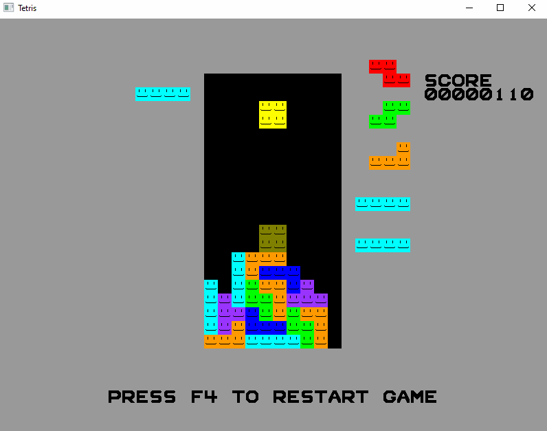

# my_tetris
I made tetris in C++ (could honestly convert into C real easily though) using OpenGL and GLFW

# Build
This project is compiled using the MSVC compiler via the command line (information about the command line compiler can be found [here](https://learn.microsoft.com/en-us/cpp/build/building-on-the-command-line?view=msvc-170)). Before building this project, you need to have built the GLFW library, and set the library and include path in `build.bat`.

To build:
1. Open a terminal with `vcvarsall.bat` running.
2. Run `build.bat`.

